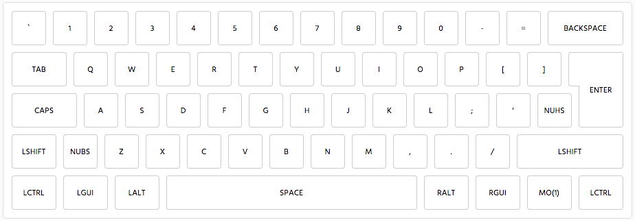
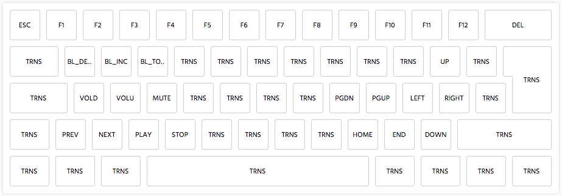
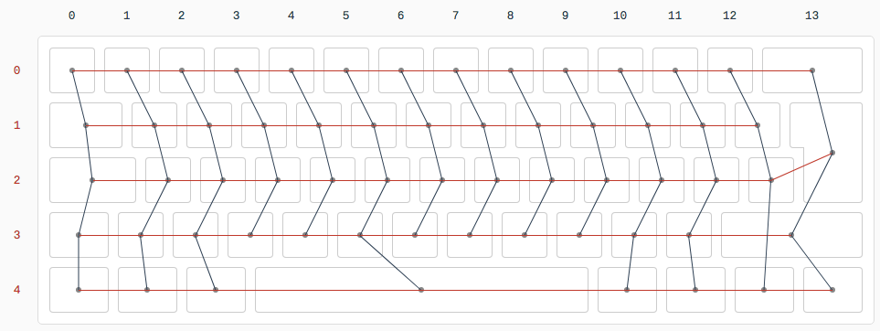

## GH60 Satan ISO firmware

### Layer 0
Standard ISO 60% layout:

### Layer 1
Function keys, media controls, and LED controls:

### Wiring Diagram
Wiring diagram for this PCB:

---
Layout designed using http://www.keyboard-layout-editor.com/

Firmware built using https://kbfirmware.com/
